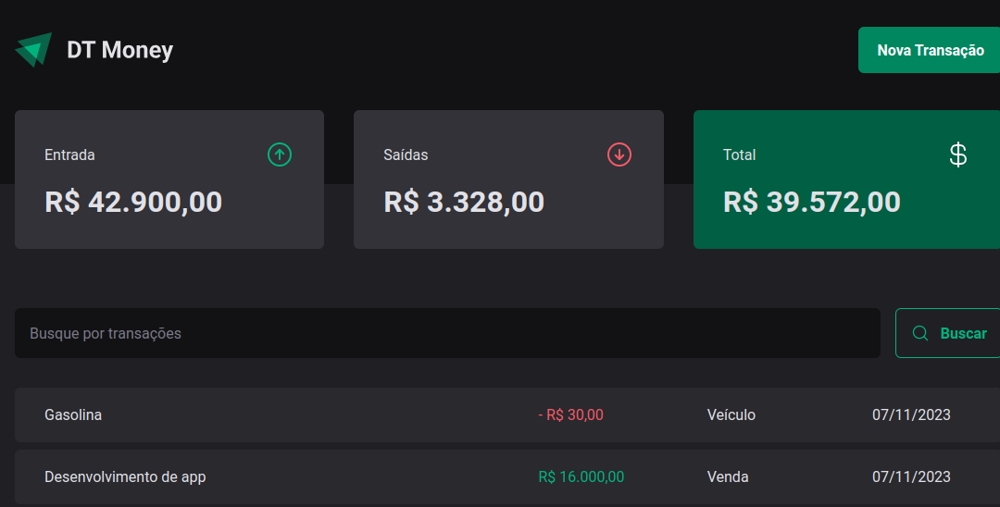

# Projeto 3 ignite - DT Money

Neste projeto construimos uma aplicação frontend web completa, conectando a uma API e trabalhamos como performar aplicações React entendendo como funciona os algoritmos iternos da biblioteca e todo fluxo de renderização de componentes.

<br>



<br>

## Tecnologias

Abaixo tecnologias usadas no projeto:

- React
- Typescript
- Styled Components
- Phosphor Icons
- JSON Server
- React Hook Form
- Zod
- Axios
- Context Selectors

Trabalhamos com Hooks nativos do React como: 

- useCallback
- useMemo

## Para rodar a aplicação

> Clone o repositório
```
  git clone 
```

> Acesse a pasta
```
  cd dt_money
```

> Instale as dependências
```
  npm install
```

> Rodar aplicação
```
  npm run dev
  npm run dev:server
```

A aplicação está rodando em http://localhost:3333
